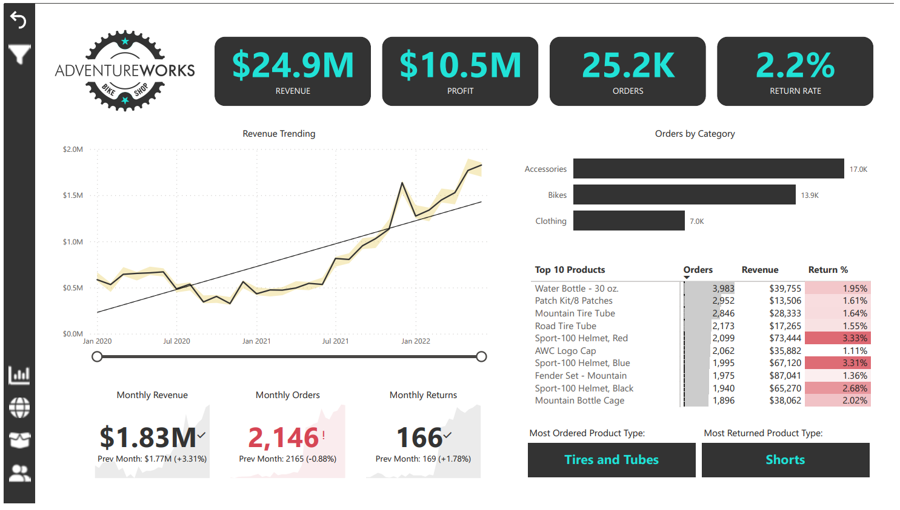

# AdventureWorks Power BI Dashboard

Welcome to the AdventureWorks Power BI Dashboard repository! This project showcases an interactive dashboard created using Power BI, providing insights into the AdventureWorks database. The dashboard is designed to highlight key metrics and trends within the AdventureWorks data using custom DAX measures and a variety of visualization tools.

## Features

- Interactive visualizations for in-depth analysis of AdventureWorks data.
- Utilizes custom DAX measures to calculate and present key metrics.
- Employs a diverse range of visualization tools including charts, tables, and maps.
- Offers drill-through functionality for deeper data exploration and insights.

## Screenshots

### Executive Dashboard

*An overview of the key performance indicators and metrics, giving a snapshot of the business health.*

